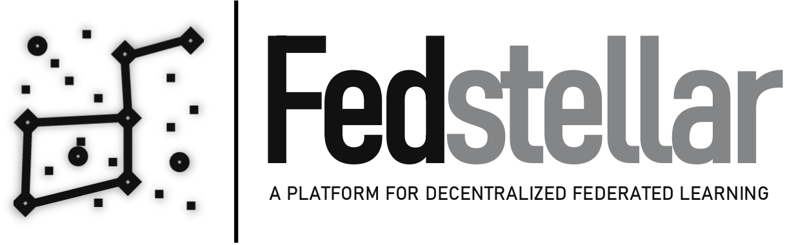
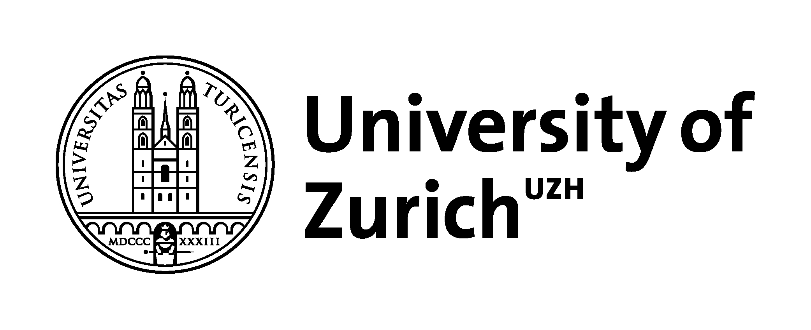

<!-- PROJECT LOGO -->
<br>
<p align="center">
  <a href="https://github.com/enriquetomasmb/fedstellar">
    
  </a>
  <h3 align="center">Fedstellar</h3>

  <p align="center">
    A Platform for Decentralized Federated Learning
    <br>
  </p>
</p>

## About Fedstellar

[](https://fedstellar.enriquetomasmb.com)

[](https://github.com/enriquetomasmb/fedstellar/issues)

Fedstellar is an innovative platform that facilitates the training of Federated Learning models in a decentralized fashion across many physical and virtualized devices. Also, the platform enables the creation of a standard approach for developing, deploying, and managing federated applications.
<br><br>
The platform supports the establishment of federations comprising diverse devices, network topologies, and algorithms. It also provides sophisticated federation management tools and performance metrics to facilitate efficient learning process monitoring. This is achieved through extensible modules that offer data storage and asynchronous capabilities alongside efficient mechanisms for model training, communication, and comprehensive analysis for federation monitoring.
<br><br>
The platform incorporates a modular architecture comprising three elements:

- **Frontend**: A user-friendly frontend for experiment setup and monitoring.
- **Controller**: A controller for effective orchestration of operations.
- **Core**: A core component deployed in each device for model training and communication.


<br><br>
Fedstellar is developed by Enrique Tomás Martínez Beltrán in collaboration with the [University of Murcia](https://www.um.es/en), [armasuisse](https://www.armasuisse.ch/en), and the [University of Zurich (UZH)](https://www.uzh.ch/).

<a href="https://um.es">
  
</a>
<a href="https://www.armasuisse.ch/en">
  
</a>
<a href="https://www.uzh.ch/">
  
</a>
<br><br>
For any questions, please contact Enrique Tomás Martínez Beltrán <a href="mailto:enriquetomas@um.es">enriquetomas@um.es</a>.


## Support

If you are having issues, please [create an issue](https://github.com/enriquetomasmb/fedstellar/issues) or start a [discussion](https://github.com/enriquetomasmb/fedstellar/discussions).


## Contributing

Contributions are what make the open source community such an amazing place to learn, create and get inspired. _Fedstellar_ platform is specially designed to be extended with little effort.

Any contributions you make are **greatly appreciated**. To do so, follow the next steps:

1. Fork the Project
2. Create your Feature Branch (`git checkout -b feature/AmazingFeature`)
3. Commit your Changes (`git commit -m 'Add some AmazingFeature'`)
4. Push to the Branch (`git push origin feature/AmazingFeature`)
5. Open a Pull Request


## License

Distributed under the MIT License. See `LICENSE` for more information.

## BibTeX Citation

If you use Fedstellar in a scientific publication, we would appreciate using the following citations:

```
@article{MartinezBeltran:Fedstellar:2023,
    title     = {Fedstellar: A Platform for Decentralized Federated Learning},
    author    = {Mart{\'i}nez Beltr{\'a}n, Enrique Tom{\'a}s and Perales G\'omez, \'Angel Luis and Feng, Chao and S{\'a}nchez S{\'a}nchez, Pedro Miguel and L{\'o}pez Bernal, Sergio and Bovet, G{\'e}r{\^o}me and Gil P{\'e}rez, Manuel and Mart{\'i}nez P{\'e}rez, Gregorio and Huertas Celdr{\'a}n, Alberto},
    journal   = {X},
    year      = {2023},
}
```

```
@article{MartinezBeltran:DFL:2022,
  title={{Decentralized Federated Learning: Fundamentals, State-of-the-art, Frameworks, Trends, and Challenges}},
  author={Mart{\'i}nez Beltr{\'a}n, Enrique Tom{\'a}s and Quiles P{\'e}rez, Mario and S{\'a}nchez S{\'a}nchez, Pedro Miguel and L{\'o}pez Bernal, Sergio and Bovet, G{\'e}r{\^o}me and Gil P{\'e}rez, Manuel and Mart{\'i}nez P{\'e}rez, Gregorio and Huertas Celdr{\'a}n, Alberto},
  journal={arXiv preprint arXiv:2211.08413},
  year={2022}
}
```

## Main Author

* **Enrique Tomás Martínez Beltrán** - [Website](https://enriquetomasmb.com) - [Email](mailto:enriquetomas@um.es)
