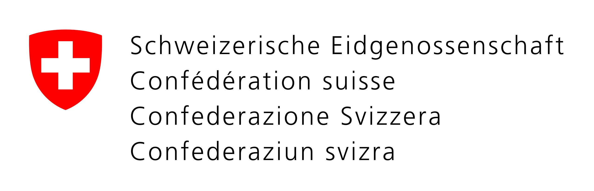

<!-- PROJECT LOGO -->
 

  
  <h3 align="center">Fedstellar</h3>

  

    A Framework for Decentralized Federated Learning
     
  

## About the project

Fedstellar is a modular, adaptable and extensible framework for creating centralized and decentralized architectures using Federated Learning. Also, the framework enables the creation of a standard approach for developing, deploying, and managing federated learning applications.
  
The framework enables developers to create distributed applications that use federated learning algorithms to improve user experience, security, and privacy. It provides features for managing data, managing models, and managing federated learning processes. It also provides a comprehensive set of tools to help developers monitor and analyze the performance of their applications.
 
 
The framework is developed by Enrique Tomás Martínez Beltrán in collaboration with the University of Murcia and Armasuisse.

  
For any questions, please contact Enrique Tomás Martínez Beltrán <a href="mailto:enriquetomas@um.es">enriquetomas@um.es</a>.

## Roadmap

See the [open issues](https://github.com/enriquetomasmb/fedstellar/issues) for a list of proposed features (as well as known issues).

## Contributing

Contributions are what make the open source community such an amazing place to learn, create and get inspired. _Fedstellar_ framework is specially designed to be extended with little effort.

Any contributions you make are **greatly appreciated**. To do so, follow the next steps:

1. Fork the Project
2. Create your Feature Branch (`git checkout -b feature/AmazingFeature`)
3. Commit your Changes (`git commit -m 'Add some AmazingFeature'`)
4. Push to the Branch (`git push origin feature/AmazingFeature`)
5. Open a Pull Request

## License

Distributed under the MIT License. See `LICENSE` for more information.

## Author

* **Enrique Tomás Martínez Beltrán** - [Website](https://enriquetomasmb.com) - [Email](mailto:enriquetomas@um.es)
